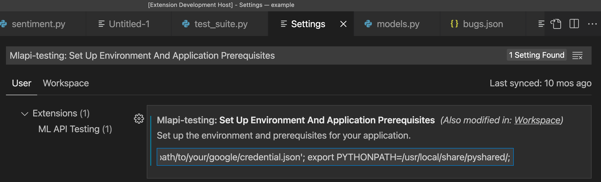
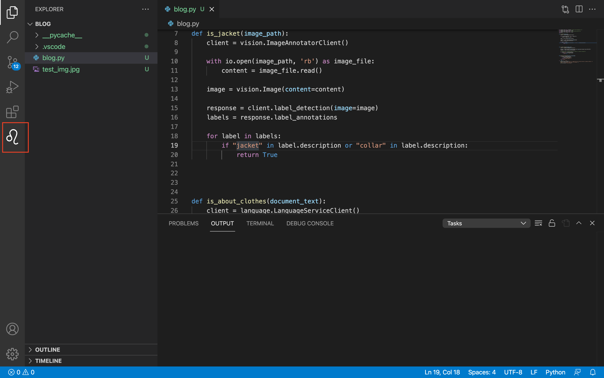
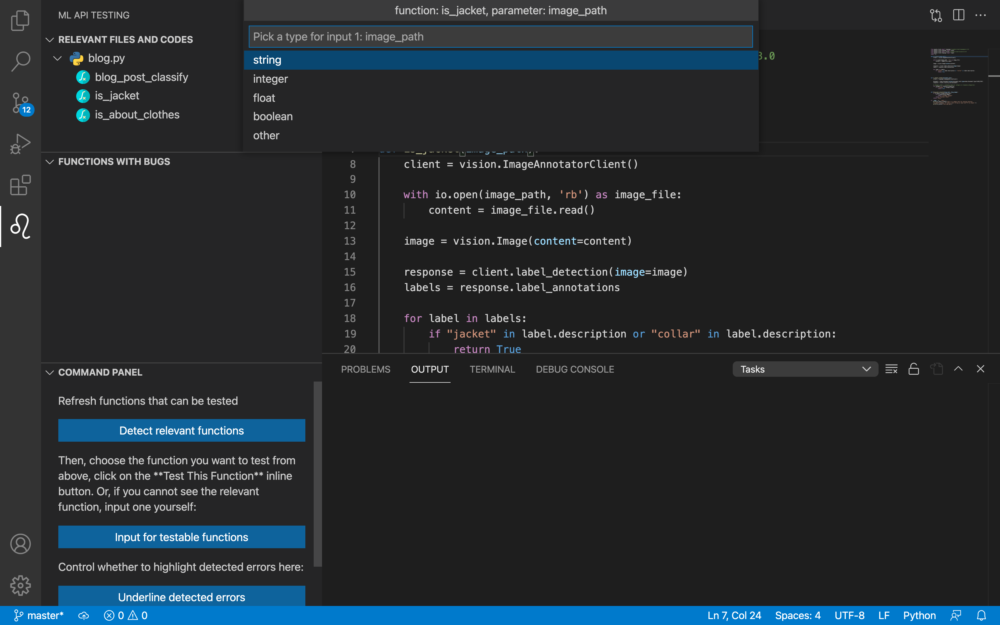
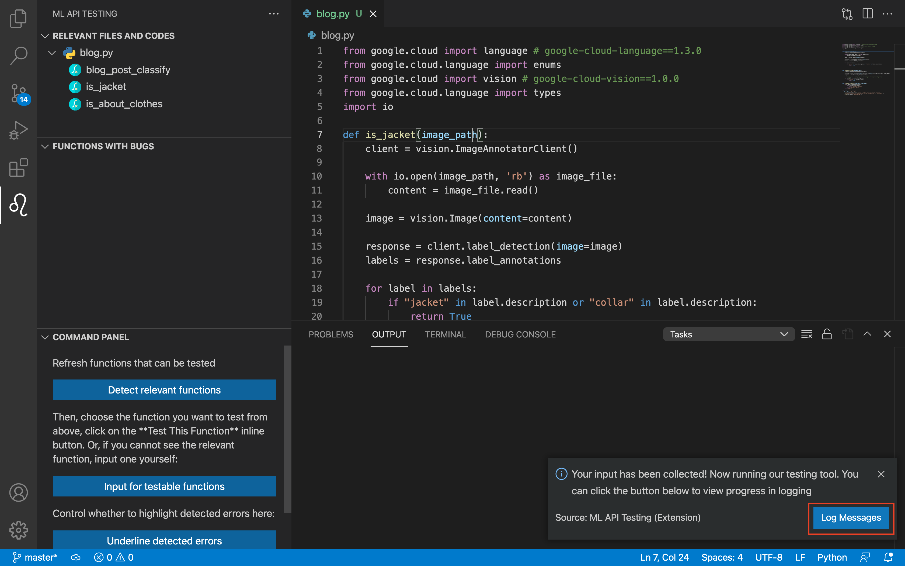

# IDE plugin

This folder contains VS Code IDE plugin for our testing tool.

There are two ways to launch our plugin: either directly through [source code](#source_code), or use our pre-packaged [extension package file](#package_file).

We provide an example input in `ide_plugin/plugin_example`. To use this example, please open this folder in the new VS Code window after plugin is launched.

## How to launch IDE plugin from source code <a name="source_code"></a>
Open the **`ide_plugin/` folder** in VS Code. Please make sure it is not the parent/child folder of `ide_plugin/`, otherwise VS Code would not able to parse the project.

Then select `ide_plugin/src/extension.ts`. Click "run" -> "start debugging" on the top menu or press F5. The plugin interface would appear in a new VS Code window.


## How to launch IDE plugin from pre-packaged extension package file <a name="package_file"></a>

Inside this folder, there is also a file called `mlapitesting-0.0.1.vsix`, which can be directly run through the VS Code package manager `vsce` to locally install the plugin. Details can be found [here](https://code.visualstudio.com/api/working-with-extensions/publishing-extension#packaging-extensions).


## How to use the plugin interface

Set up environment and application prerequisites. This is the line that gets executed before any of our analysis file runs. Typically, one should include (1) `export` the google cloud credentials; (2) `export` the path to CVC4; (3) any other commands needed to activate a virtual environment (e.g. anaconda) for the particular python environment we require, etc. This can be done by going to the **Settings** in VS Code (details can be found on the VS Code documentations [here](https://code.visualstudio.com/docs/getstarted/settings)), search for **Mlapi-testing: Set Up Environment And Application Prerequisites**, and modify the entry to include these. An example of including (1) and (2) is:
```
export GOOGLE_APPLICATION_CREDENTIALS='/path/to/your/google/credential.json'; export PYTHONPATH=/usr/local/share/pyshared/;
```
where details can be found in `../INSTALL.md`. Note that we expect a semicolon after each statement.


Then, follow the following procedure to complete a typical testing. In the bottom-left corner, there is a "Show logs" button that can help you debug certain environment errors, if needed.

1. Click on the plugin icon on the left side of your screen to reveal the plugin window. It may take several seconds.

2. Next, click on the refresh button in the upper right hand corner of the plugin window, or the "Detect Relevant Functions" button in the bottom third of the plugin window, in order to find functions that can be tested by our plugin.

3. Next, click on the function you want to test and click on the button "Test This Function" located to the right of the function name. You can also input information for a function not shown in the plugin window by clicking on the "Input for testable functions" button.

4. Next, for each of the selected function's parameters, fill out what type the parameter is and whether it is used in a Machine Learning Cloud API.

5. Once the types have been inputted you will see a pop-up window where you can click the "Log Messages" button. Clicking this button will allow you to see the progress of our tool while it runs. Depend on the network and number of test cases, it may take several minutes to execute.

6. Congrats! Right under the view for the testable functions you will see information about any bugs or inefficiencies your selected function has. You will also see the lines of code with bugs underlined for you! If you want to remove the underlines, click the "Remove underlines" button.


## GIF demo

